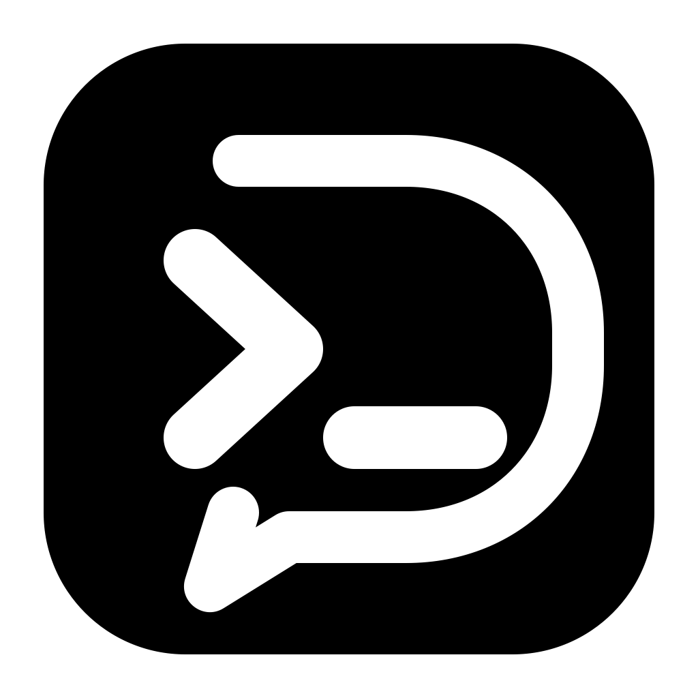

# DeepSeek Harness Desktop

English | [简体中文](README.zh-CN.md)

[](https://github.com/TonyWang-hub/deepseek-harness-desktop/actions/workflows/ci.yml) [](LICENSE)

<p align="center"></p>

An unofficial macOS desktop shell for [DeepSeek Harness](https://github.com/deepseek-ai/deepseek-harness). It runs the pinned, unmodified official `@deepseek-ai/dsh` Web application inside Electron and keeps the standard `$DSH_HOME`, so the desktop app and `dsh` share profiles, credentials, sessions, tools, and plugins.

> **Distribution status — v0.4.3 is the latest signed and notarized macOS release.** Download only from this repository's [latest release](https://github.com/TonyWang-hub/deepseek-harness-desktop/releases/latest), choose the native architecture, and verify the published checksum and Apple signature. Locally generated unsigned candidates remain test artifacts and must not be redistributed as official releases.
>
> **Upgrade warning — manual bridge required:** The strict public v0.4.1→v0.4.2 proof failed because the old app exposed the update after proxy transfer, before native Squirrel staging was ready. v0.4.3 waits for Electron's native `update-downloaded` signal before enabling install-on-quit, but v0.4.2 and earlier control their own broken transition and cannot reliably acquire that fix. Install the matching v0.4.3 DMG manually. Automatic installation will not be claimed until a separate public v0.4.3→v0.4.4 proof succeeds.

## Why this build

Community desktop clients already cover broader platforms, custom onboarding, and smaller Tauri or WebView shells. This project deliberately optimizes for a narrower set of properties:

- **No upstream fork or patch layer.** The payload is the exact pinned npm release, currently `@deepseek-ai/dsh@0.1.0-rc.6`. Updating it changes the package version and lockfile instead of rebasing desktop changes onto upstream UI code.
- **One data home.** The shell does not replace `$DSH_HOME`; the CLI and desktop app see the same Harness state without import or migration.
- **No first-run runtime download.** Node.js, `pnpm@11.21.0`, the official production dependency tree, ripgrep, and architecture-specific native modules are inside the application. Model and web-provider calls can still require network access; "offline payload" does not mean offline model inference.
- **Resident desktop workflow.** Closing the window keeps the single Host and its sessions alive; the tray and macOS Dock menu reopen the same window or explicitly quit.
- **Owned process lifetime.** The app waits for Host readiness, stops rapid crash loops after finite bounded retries with a manual recovery page, uses TERM→KILL on normal shutdown, and gives the Host a parent-lifetime pipe so a crashed desktop process does not leave it running.
- **Wake-aware reliability.** One desktop state machine coordinates startup, readiness, offline waiting, recovery, circuit-open, update-ready, and quitting. macOS resume/unlock reloads only the page when the Host is healthy, does not count offline transitions as crashes, and replaces an unreachable local Host without creating duplicates.
- **Private diagnostics.** **Export Diagnostics…** in the tray and Dock menus writes an owner-only (`0600`) allowlisted JSON self-check. It reports versions, desktop/Host state, update readiness, and bundled runtime checks without collecting sessions, Host logs, environment values, credentials, `$DSH_HOME`, or personal paths.
- **Behavior and artifact evidence.** CI replays a deterministic external-plugin session through direct-browser and desktop entries, including tools, approval, and an error. arm64 and x64 builds also execute the packaged Host, official plugin command, bundled Node and pnpm launchers, ripgrep, Sharp, Koffi, `node-pty`, and a real PTY before acceptance.

This reduces upstream adaptation work; it does not make the shell official or guarantee that every future Harness release will package without changes.

## Architecture

```text
DeepSeek Harness Desktop (Electron main)
├─ desktop state + wake/network recovery controller
├─ Host supervisor and parent-lifetime pipe
│  └─ bundled Node → host bootstrap → @deepseek-ai/dsh web --port 0
├─ allowlisted private diagnostics export
├─ app-local bin/node and bin/pnpm for Host tools and child processes
└─ sandboxed BrowserWindow → http://127.0.0.1:<random-port>
                               └─ official Harness Web UI

standard $DSH_HOME ← shared by the desktop app and dsh CLI
```

Electron owns only the native window, process supervision, packaging, and update integration. Harness owns the interface and agent behavior. The Host listens on an operating-system-assigned loopback port; the window blocks other origins, denies new windows, and grants only sanitized clipboard writes to the trusted local origin.

The application uses Electron's bundled Node runtime for the Host and clears Electron-only process markers before Harness or its child commands run. `DSH_DESKTOP_NODE=/absolute/path/to/node` remains an advanced fallback for an upstream native-runtime incompatibility.

## Download and install

### Release availability

The [latest release, v0.4.3](https://github.com/TonyWang-hub/deepseek-harness-desktop/releases/tag/v0.4.3), provides signed, notarized, and stapled macOS arm64/x64 artifacts, checksums, and update metadata. It is the manual bridge containing the native-readiness fix; install its matching DMG because the public proof failed for the old transition and the repaired path still awaits a v0.4.3→v0.4.4 public proof. Repositories with similar names publish independent community builds with different code, data paths, update policies, and signing status.

### Choose Apple Silicon or Intel

Open **Apple menu → About This Mac** and check the processor or chip:

| Mac | Architecture | Expected DMG name after release |
| --- | --- | --- |
| Apple M-series chip | `arm64` | `DeepSeek-Harness-Desktop-<version>-mac-arm64.dmg` |
| Intel processor | `x64` | `DeepSeek-Harness-Desktop-<version>-mac-x64.dmg` |

Rosetta is not required when the DMG matches the Mac. Do not install the arm64 build on Intel or use the x64 build as the default on Apple Silicon.

### Install a signed build

1. Download the matching DMG from this project's [latest release](https://github.com/TonyWang-hub/deepseek-harness-desktop/releases/latest).
2. Compare its SHA-256 with `SHA256SUMS.txt`; always verify the installed application's Apple signature.
3. Open the DMG and drag **DeepSeek Harness Desktop** to **Applications**.
4. Launch it from Applications. A "developer cannot be verified" warning on an advertised official release is a reason to stop and verify the source, not a reason to bypass Gatekeeper.

## Verify a release

### SHA-256

Every release publishes authoritative SHA-256 values in `SHA256SUMS.txt`. Calculate the matching download and compare all 64 hexadecimal characters:

```sh
shasum -a 256 ~/Downloads/DeepSeek-Harness-Desktop-<version>-mac-arm64.dmg
shasum -a 256 ~/Downloads/DeepSeek-Harness-Desktop-<version>-mac-x64.dmg
```

Use only the line for the architecture you downloaded. The automatic updater separately uses SHA-512 values stored in `latest-mac.yml`; those values are generated from and checked against every update artifact before the two architecture manifests are merged.

### Apple signature and notarization

After copying the application to `/Applications`, macOS can verify the same three properties required by the formal build:

```sh
codesign --verify --deep --strict --verbose=2 "/Applications/DeepSeek Harness Desktop.app"
spctl --assess --type execute --verbose=4 "/Applications/DeepSeek Harness Desktop.app"
xcrun stapler validate "/Applications/DeepSeek Harness Desktop.app"
```

All commands must exit successfully. Gatekeeper should report an accepted Developer ID application, and `stapler` should report a valid ticket. The build fails if any check fails or notarization is skipped. Only `HARNESS_DESKTOP_ALLOW_UNSIGNED=1` disables these checks for a local test build, and that mode also disables automatic signing-identity discovery to avoid a misleading partial signature.

## Automatic updates

The public GitHub release feed provides dual-architecture update metadata. A packaged production app performs one non-blocking check after launch. If an update is available, it waits for the download and notifies the user that installation will occur when the app exits; network or feed errors are reported without blocking Harness startup.

The real signed v0.4.1→public v0.4.2 proof showed that electron-updater's proxy-transfer promise resolved before native Squirrel emitted its install-ready event. The app exposed `updating` too early, so explicit Quit entered the installer before staging was ready and eventually fell back with v0.4.1 still installed. v0.4.3 registers the native observer before checking, requires both proxy transfer and native `update-downloaded`, then performs exact Host shutdown and the existing `quitAndInstall()` / `before-quit-for-update` handshake. Install the v0.4.3 DMG manually when upgrading from v0.4.2 or earlier; the repaired automatic path remains unclaimed until the public v0.4.3→v0.4.4 proof. Source builds and smoke mode do not check for updates.

A release feed is published only after its merged `latest-mac.yml`, arm64 and x64 ZIP/DMG files, and blockmaps pass exact-inventory, checksum, signing, notarization, stapling, packaged-acceptance, and mounted-DMG gates together.

## Mac Reliability in v0.4.0

The signed and notarized v0.4.0 release includes these behaviors on both native Mac architectures:

- On macOS resume or unlock, a healthy loopback Host keeps its exact PID and port while the same BrowserWindow reloads its page transport.
- When macOS reports the network offline, the desktop waits and retries without restarting the Host or advancing the three-failure crash circuit.
- If the machine is online but the current loopback Host is unreachable, the desktop intentionally replaces that exact Host and verifies that only one replacement remains. Generation checks prevent delayed probes or page loads from changing a newer Host's state.
- Use the tray or Dock menu's **Export Diagnostics…** action to save an allowlisted self-check. The JSON file is set to owner-only mode before any content is written. Review it before attaching it to an issue; it intentionally excludes conversation data, raw Host output, environment values, credentials, and private paths.

## Build and validate from source

### Development

Prerequisites: macOS and Node.js `24.17.x` on the current architecture.

```sh
npm ci
npm run smoke
npm start
```

`npm run smoke` starts the real official Host on a random loopback port, loads its Web UI, and waits for clean Host shutdown.

### Local unsigned packages

Unsigned packages are for local acceptance only:

```sh
HARNESS_DESKTOP_ALLOW_UNSIGNED=1 npm run dist:mac:arm64
HARNESS_DESKTOP_ALLOW_UNSIGNED=1 npm run dist:mac:x64
```

Run only the command matching the current Node process and clean dependency installation. The build rejects an architecture mismatch or missing target-specific native package, then automatically runs the packaged acceptance suite. Do not publish, redistribute, or present these artifacts as trusted downloads.

### Packaged acceptance

Each architecture build verifies:

- every installed production package is present as a physical packaged file;
- a clean `$DSH_HOME` can cold-start the official Host and Web UI and releases its loopback port on exit;
- the official plugin command finds bundled pnpm, while child processes see bundled Node rather than Electron GUI mode;
- ripgrep, Sharp, Koffi, `node-pty`, and a real shell PTY execute from the packaged application;
- healthy resume, offline waiting, and intentional unhealthy-Host replacement preserve the same window, keep crash accounting correct, and leave exactly one Host;
- an actual exported diagnostic file is mode `0600` and excludes injected secrets and private paths; and
- the application has the requested Mach-O architecture and leaves no Host process after normal exit or parent death.

See [PLAN.md](PLAN.md) for release acceptance evidence and the cross-platform roadmap.

## Community

- Read [Contributing](CONTRIBUTING.md) before opening a pull request.
- Use [Discussions](https://github.com/TonyWang-hub/deepseek-harness-desktop/discussions) for questions and setup help.
- Use the structured issue forms for reproducible bugs and desktop feature requests.
- Follow the [Security](SECURITY.md), [Support](SUPPORT.md), and [Code of Conduct](CODE_OF_CONDUCT.md) policies.

## Community comparison

Snapshot: 2026-08-15. This is a scope comparison, not a ranking; verify the linked repositories because these early projects change quickly.

| Project | Published desktop assets | Payload and data | Updates | Signing and notarization evidence |
| --- | --- | --- | --- | --- |
| This project | [v0.4.3](https://github.com/TonyWang-hub/deepseek-harness-desktop/releases/tag/v0.4.3): macOS arm64/x64 DMG and ZIP, update metadata, and checksums | Pinned, unmodified npm payload; standard `$DSH_HOME`; bundled runtime; wake recovery and private diagnostics | Native-readiness repair included; manual v0.4.3 bridge required while v0.4.3→v0.4.4 proof is pending | Release workflow verifies `codesign`, Gatekeeper, a stapled notarization ticket, packaged acceptance, and mounted DMGs |
| [anywhere-labs/deepseek-harness-desktop](https://github.com/anywhere-labs/deepseek-harness-desktop) | [v0.1.0](https://github.com/anywhere-labs/deepseek-harness-desktop/releases/tag/v0.1.0): macOS arm64 and Windows x64 | Electron desktop app inside a full Harness source tree; stages workspace packages; tray integration | No updater is declared in the current [desktop manifest](https://github.com/anywhere-labs/deepseek-harness-desktop/blob/master/apps/desktop/package.json) | v0.1.0 does not document artifact trust; current source includes a separate [macOS release preflight](https://github.com/anywhere-labs/deepseek-harness-desktop/blob/master/apps/desktop/scripts/release-preflight.ts) |
| [dataelement/dsh-desktop](https://github.com/dataelement/dsh-desktop) | [v0.1.7](https://github.com/dataelement/dsh-desktop/releases/tag/v0.1.7): macOS arm64/x64 and Windows x64, with update metadata | Pinned rc.6 packages plus documented [`patch-package` overlays](https://github.com/dataelement/dsh-desktop/tree/main/patches) for desktop features; app-specific Harness data directory | [Electron updater](https://github.com/dataelement/dsh-desktop/blob/main/src/main/update/update-manager.ts) checks installed macOS and Windows builds | The [release workflow](https://github.com/dataelement/dsh-desktop/blob/main/.github/workflows/release.yml) verifies macOS with `codesign`, Gatekeeper, and `stapler`; its [manifest](https://github.com/dataelement/dsh-desktop/blob/main/package.json) disables Windows update code-signature verification |
| [steven-kid/deepseek-harness-desktop](https://github.com/steven-kid/deepseek-harness-desktop) | [v0.3.4](https://github.com/steven-kid/deepseek-harness-desktop/releases/tag/v0.3.4): macOS arm64/x64, Windows x64, and Linux x64 | Electron, pinned official rc.6 UI, standard Harness data, tray integration | Its [README](https://github.com/steven-kid/deepseek-harness-desktop#known-limitations) says automatic updates are not integrated | The same README says macOS is not Apple-notarized and Windows is not commercially code-signed |
| [hairyf/deepseek-harness-desktop](https://github.com/hairyf/deepseek-harness-desktop) | [v0.1.9](https://github.com/hairyf/deepseek-harness-desktop/releases/tag/v0.1.9): macOS arm64/x64, Windows x64, and Linux x64 | Tauri control shell; downloads a prebuilt Harness bundle on first launch; app-specific `$DSH_HOME` | Checks and replaces its Harness bundle independently of the desktop app | Its [release workflow](https://github.com/hairyf/deepseek-harness-desktop/blob/main/.github/workflows/release.yml) configures Tauri updater keys but no Apple Developer signing or notarization credentials |
| [xiincs/deepseek-harness-desktop](https://github.com/xiincs/deepseek-harness-desktop) | [v1.0.0](https://github.com/xiincs/deepseek-harness-desktop/releases/tag/v1.0.0): macOS arm64, Windows x64, and Linux x64 | Tauri shell with bundled Node/DSH and standard `~/.dsh` | Signed Tauri updater artifacts are configured for Windows; macOS/Linux are download-only | Its [README](https://github.com/xiincs/deepseek-harness-desktop#deepseek-harness-desktop-tauri) explicitly labels macOS/Linux builds unsigned and unnotarized |

Choose another community client if Windows/Linux support, customized provider onboarding, preset transfer, or the smallest shell is the priority. Choose this project when exact upstream behavior, a resident tray workflow, shared CLI state, no first-run runtime download, deep packaged-runtime checks, and a fail-closed macOS release policy matter more than those additions.

## Upstream relationship, license, and trademarks

This repository is an independent shell, not a DeepSeek product. Unmodified payload files come from [deepseek-ai/deepseek-harness](https://github.com/deepseek-ai/deepseek-harness) and retain their upstream licenses and notices. The shell source is available under the [MIT License](LICENSE); bundled third-party dependencies remain under their own licenses.

"DeepSeek", "DeepSeek Harness", related logos, and other marks belong to their respective owners. Their use identifies compatibility and upstream provenance only; it does not imply affiliation, sponsorship, certification, or endorsement.
